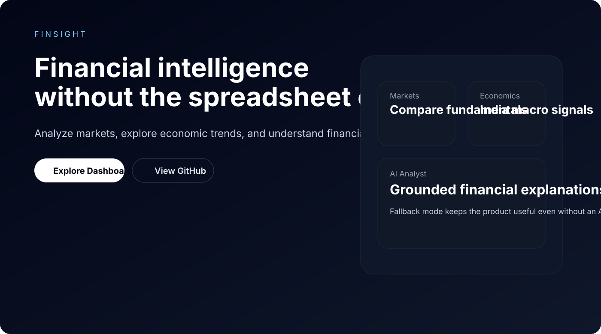
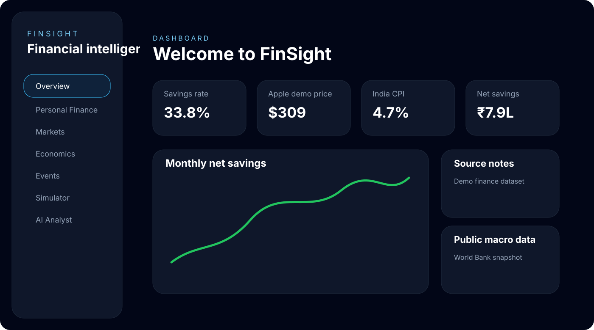
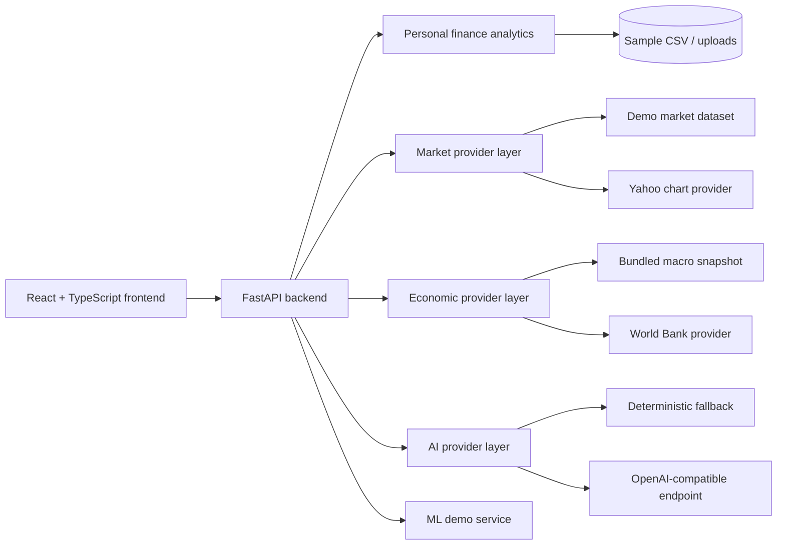

# FinSight


**FinSight** is an AI-powered financial and economic intelligence platform built as a polished open-source portfolio project.

> Explore markets. Understand economies. Analyze your finances.

FinSight combines:
- personal finance analytics
- stock and company analysis
- India-focused macroeconomic indicators
- economic event analysis
- scenario simulation
- AI-assisted explanations
- a small machine learning demo

It is **educational/research-oriented** and **does not provide personalized financial advice**.

---

## Demo

- Frontend: run locally with `npm run dev` in `frontend/`
- Backend API docs: `http://localhost:8000/docs`
- Demo mode: enabled by default, so the app works without API keys

## Screenshots

Landing preview:



Dashboard preview:



## Features

### Personal Finance Analyzer
- CSV upload with validation
- bundled demo transaction dataset
- income vs expense breakdown
- monthly savings and spending trends
- category analysis
- recurring expense detection
- budget comparison view

### Stock & Company Analyzer
- provider-based market data architecture
- historical price charts
- demo company fundamentals
- multi-company comparison table
- clean fallback when live data is unavailable

### Economic Intelligence Dashboard
- India-focused public macro indicators
- source, units, frequency, and last-updated metadata
- time-series visualizations
- demo snapshot mode + live World Bank provider option

### Economic Event Analyzer
- curated event catalog
- before/during/recovery comparison windows
- transmission mechanism summaries
- careful non-causal language

### What-if Simulator
- adjustable repo rate, oil, inflation, and fiscal assumptions
- baseline vs scenario comparison
- transparent assumptions and methodology

### AI Financial Analyst
- provider abstraction for remote LLMs
- fallback mode when no API key exists
- context-grounded prompts built from verified in-app data
- references and caveats in responses

### Machine Learning Demo
- synthetic risk-style classification dataset
- Logistic Regression vs Random Forest
- accuracy, precision, recall, F1, and confusion matrix

---

## Architecture



See also:
- [`docs/architecture.md`](docs/architecture.md)
- [`docs/methodology.md`](docs/methodology.md)
- [`docs/data-sources.md`](docs/data-sources.md)

---

## Tech Stack

### Frontend
- React
- TypeScript
- Vite
- Tailwind CSS
- Recharts

### Backend
- Python
- FastAPI
- Pydantic
- SQLAlchemy
- Pandas / NumPy

### Machine Learning
- scikit-learn

### Quality / DX
- Pytest
- Vitest
- Ruff
- Black
- ESLint
- Prettier
- Docker / Docker Compose
- GitHub Actions

### Why this stack?
- **FastAPI** provides strong typing, OpenAPI docs, and fast iteration.
- **React + TypeScript** make the UI componentized and maintainable.
- **Pandas / NumPy** are a natural fit for financial and time-series analytics.
- **SQLAlchemy + SQLite** keep local development simple while leaving a migration path to PostgreSQL.
- **Provider abstractions** keep demo mode and live data integrations decoupled.

---

## Getting Started

### 1) Clone the repository

```bash
git clone https://github.com/your-username/finsight.git
cd finsight
```

### 2) Configure environment variables

```bash
cp .env.example .env
```

### 3) Install dependencies

#### Backend
```bash
cd backend
pip install -e .[dev]
```

#### Frontend
```bash
cd ../frontend
npm install
```

### 4) Run the app

#### Terminal 1 — backend
```bash
cd backend
uvicorn app.main:app --reload --host 0.0.0.0 --port 8000
```

#### Terminal 2 — frontend
```bash
cd frontend
npm run dev -- --host 0.0.0.0 --port 5173
```

### 5) Open the app
- Frontend: `http://localhost:5173`
- Backend docs: `http://localhost:8000/docs`

---

## Environment Variables

See [`.env.example`](.env.example).

Important values:
- `DEMO_MODE=true` — keeps the app functional without external credentials
- `MARKET_PROVIDER=demo|yfinance`
- `ECONOMIC_PROVIDER=demo|world_bank`
- `AI_PROVIDER=fallback|openai_compatible`
- `OPENAI_API_KEY` / `OPENAI_BASE_URL` — only needed for remote LLM integration
- `VITE_API_BASE_URL` — frontend API base URL (defaults to `/api` and works with the Vite dev proxy)

---

## API Documentation

Core endpoints:
- `GET /api/health`
- `GET /api/finance/summary`
- `POST /api/finance/upload`
- `GET /api/markets/company/{symbol}`
- `GET /api/markets/company/{symbol}/history`
- `GET /api/markets/compare?symbols=AAPL&symbols=MSFT`
- `GET /api/economics/indicators`
- `GET /api/economics/indicators/{indicator_id}`
- `GET /api/events`
- `POST /api/events/analyze/{event_id}`
- `POST /api/simulation/run`
- `POST /api/ai/analyze`
- `GET /api/ml/risk-demo`

Interactive docs are exposed automatically by FastAPI at `/docs`.

---

## Data Sources

FinSight separates **demo datasets** from **public/live data**.

Current sources include:
- World Bank Open Data for India-focused macro indicators
- Yahoo Finance chart endpoint for optional live-like price history retrieval
- bundled demo transaction, event, market, and synthetic ML datasets for offline exploration

See [`docs/data-sources.md`](docs/data-sources.md) for details.

---

## Methodology

Implemented reusable calculations include:
- CAGR
- growth rate / percentage change
- moving averages
- volatility
- Sharpe ratio
- maximum drawdown
- correlation
- rolling returns
- profit margin

The scenario simulator intentionally uses a **simplified educational sensitivity model** rather than a forecasting engine.

More detail: [`docs/methodology.md`](docs/methodology.md)

---

## AI Architecture

FinSight uses a provider abstraction:
- `FallbackAIProvider`
- `OpenAICompatibleProvider`

The backend builds structured context from verified in-app data and passes it to the chosen provider. The fallback provider never pretends to know facts outside available data.

---

## Testing

### Backend
```bash
cd backend
pytest
```

### Frontend
```bash
cd frontend
npm run test -- --run
```

### Linting
```bash
make lint
```

---

## Docker

### Development with Docker Compose
```bash
docker compose up --build
```

Services:
- frontend preview on `http://localhost:4173`
- backend API on `http://localhost:8000`

See [`docker-compose.yml`](docker-compose.yml).

---

## Project Structure

```text
finsight/
├── frontend/
├── backend/
├── data/
├── docs/
├── scripts/
├── .github/
├── docker-compose.yml
├── Dockerfile
├── README.md
└── CONTRIBUTING.md
```

---

## Limitations

- Demo market fundamentals are bundled for educational/offline use and are clearly marked as demo data.
- The scenario simulator is intentionally simplified and not suitable for real forecasting.
- The ML module uses synthetic data and should not be used for lending or investment decisions.
- The fallback AI mode is deterministic and intentionally conservative.

---

## Roadmap

- richer CSV report exports
- more company coverage and live provider adapters
- more macro sources (RBI, IMF, OECD where appropriate)
- improved event-study tooling
- PostgreSQL deployment profile
- richer AI report generation workflow

---

## Contributing

Contributions are welcome. Start with:
- [`CONTRIBUTING.md`](CONTRIBUTING.md)
- [`CODE_OF_CONDUCT.md`](CODE_OF_CONDUCT.md)
- [`SECURITY.md`](SECURITY.md)

---

## License

This project is licensed under the [MIT License](LICENSE).

---

## Disclaimer

FinSight is for **educational and research purposes only**. It does **not** provide personalized financial advice, investment advice, lending decisions, or reliable economic forecasts.
